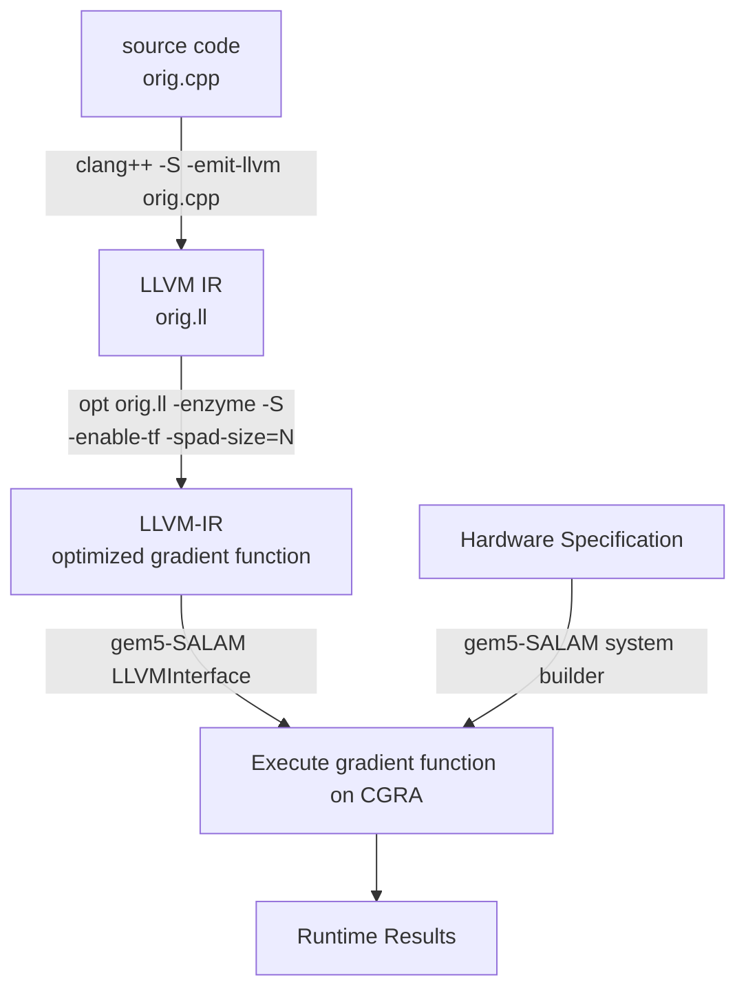

# TapeFlow #
TapeFlow is a high-performance Automatic Differentiation tool that extends the Enzyme compiler. It manages tape accesses explicitly using a scratchpad and generates a LLVM Intermediate Representation (IR). It then runs the IR on a hardware with exposed scratchpad interface. This hardware is modeled by gem5-Salam.

# Features

- Efficient and high-performance Automatic Differentiation.
- Seamless integration with the Enzyme compiler.
- Automatic memory orchestration.
- Scratchpad simulation is done by gem5-SALAM.

# Requirements
- LLVM-12 or newer. Must be installed from source.
- gem5 dependencies

# TapeFlow Setup
First, clone this repository:
```
git clone --recursive https://github.com/sfu-arch/TapeFlow.git
```
## Building the compiler
To build our comiler:
```bash
cd TapeFlowCompiler/enzyme
mkdir build && cd build
cmake -G Ninja .. -DLLVM_DIR=/path/to/llvm/lib/cmake/llvm -DLLVM_EXTERNAL_LIT=/path/to/lit/lit.py
ninja
```
Make sure the build is complete and `LLVMEnzyme-*.so` is generated in the `build/Enzyme/` directory.

## Building simulator
We use our modified version a gem5-SALAM to execute the code generated by our compiler.

### All Required Dependencies for gem5-SALAM (Ubuntu 20.04)

```bash
sudo apt install build-essential git m4 scons zlib1g zlib1g-dev \
    libprotobuf-dev protobuf-compiler libprotoc-dev libgoogle-perftools-dev \
    python3-dev python-is-python3 libboost-all-dev pkg-config
```

After installing these specific libraries, simply run the [update alternatives](https://github.com/TeCSAR-UNCC/gem5-SALAM/blob/main/docs/update-alternatives.sh) script in docs/.

### building gem5
Below is the bash command you would use to build the opt binary. 

```bash
scons build/ARM/gem5.opt -j`nproc`
```

For more information regarding the binary types, and other build information refer to the gem5 build documentation [here](http://learning.gem5.org/book/part1/building.html).

Congrats! You can now run TapeFlow.

# Using TapeFlow
The following graph illustrates the TapeFlow's toolflow:

First, we compile the source code using our compiler and then feed the resulting IR to the hardware modeled by gem5-SALAM.

## AD benchmarks

The AD examples under **benchmarks/AD** are good examples for how you to get started with TapeFlow.

In order to use these benchmarks, it is required to have the ARM GCC cross-compiler installed. If you didn't already install it when you setup the dependencies, you can install it in Ubuntu by running the below command:

```bash
sudo apt-get install gcc-arm-none-eabi
```

**tf.sh** requires an environment variable named **M5_PATH** to be set. You will want to point it to your TapeFlow path as shown below. 

```bash
export M5_PATH=/path/to/TapeFlow
```

The `tf.sh` script validates the benchmark, compiles it, introduces the ir path to gem5-SALAM, and runs the simulation. 
It runs the benchmark with and without TapeFlow's optimizations and stores the results in results.csv. This file contains runtime details including cache misses, execution cycles, total DRAM accesses, etc.
```bash
./tf.sh -b [benchmark]
```

## How to write a test case?
### Before running:
Make sure:
- The benchmark folder contains `config.yml`.
    - The `config.yml` must have a `SPM`-type variable for the SPAD. 
    - The accelerator in `config.yml` must have `LocalSlaves` set to `LocalBus` to access the DMA MMRs.
- The accelerator source code must include the `#include "benchmarks/common/dma.h"` so that we can call the `DmaCopy()`.

Look at `spmv` benchmark for more details.

run:
```
./tf.sh -b $benchmark
```
For example:
```
./tf.sh -b spmv
```

Note that the `$benchmark_clstr_hw_defines.h` and `configs/SALAM/generated/$benchmark.py` will be overwritten each time you run `./tf.sh` because it is running `systembuilder.py`. 

# FAQ
Some bugs might appear during the compile time or runtime. We mention some of them and how to resolve them.
## Error 1:
```bash
build/ARM/hwacc/llvm_interface.cc:1522: panic: No function marked as top-level. Set the top_name parameter for your LLVMInterface to the name of the top-level function
```
### Solution:
gem5-Salam can not find the top function because it is not declared in the source file or has been renamed by the compiler. You can verify this by looking at the `.ll` files created in the `hw` directory. If you have multiple `.c` files, you have to declare the top in all of them. To solve this issue, add the following lines in all of the `.c` files in the `hw` directory. This prevents the compiler to rename this function.

```C
extern "C" {
    void top();
}
```

